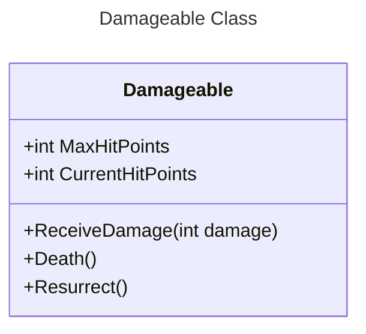
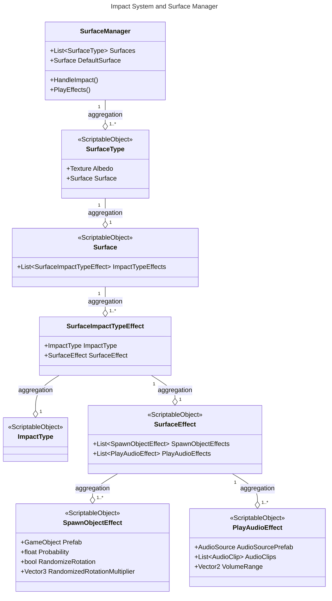

# EvilSuitcase4 (WIP)
3D third person shooter zombie wave control. Made in Unity.

The objective in this game is survive as long as you can while defeating waves of zombies. After clearing each wave, you'll receive random rewards that will help you survive next waves, but the fun part is that also certain items will be blocked randomly each wave, thus aiming for high replayability.

## Roadmap

The roadmap will be split into what has already been done and what is to be developed. A lot of code from previous projects was used (with minor tweaks) to be able to have a fast prototype.

### Done

### To Do

## Third Person Shooter Controller

Our third person shooter controller is implemented using Unity's [Starter Assets - Third Person Character Controller](https://assetstore.unity.com/packages/essentials/starter-assets-third-person-character-controller-196526) - [Unity Technologies](https://assetstore.unity.com/publishers/1).

Using this package as its base for character and movement control, we added a new class called ***ThirdPersonShooterController*** which manages all weapon related methods, such as activating equipped weapons, activating their rigs, etc.

## Damage System

Our damage system is based on a base class called ***Damageable*** which is defined as follows:

## Impact System and Surface Manager

Our impact system is an implementation of [Surface Manager](https://github.com/llamacademy/surface-manager) - [Llam Academy](https://www.youtube.com/@LlamAcademy).

Using this we are able to define audio and particle (or any game object spawn) effects for a collision depending on the type of texture of the collider. So far this is used for bullet collisions with different materials, bullet shell drops and magazine shell drops. Soon to be implemented to work on footsteps, so we can have different sound effects for different stepped objects.

Also, what makes it easy to use is that it's based on ***Scriptable Objects*** for holding all the information related to the effects, impact type and surface types. 

## Weapon System
