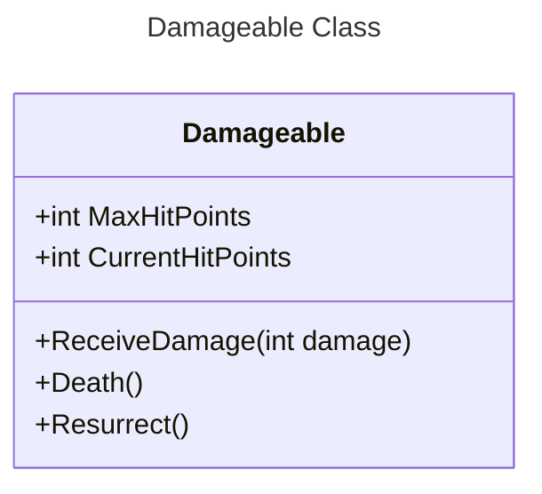
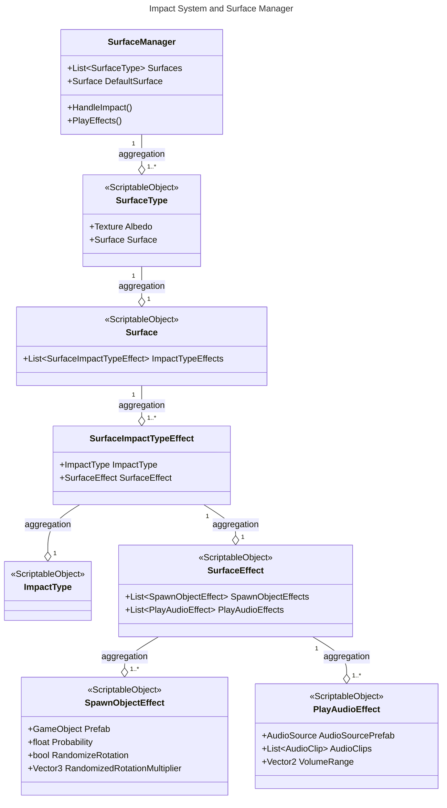
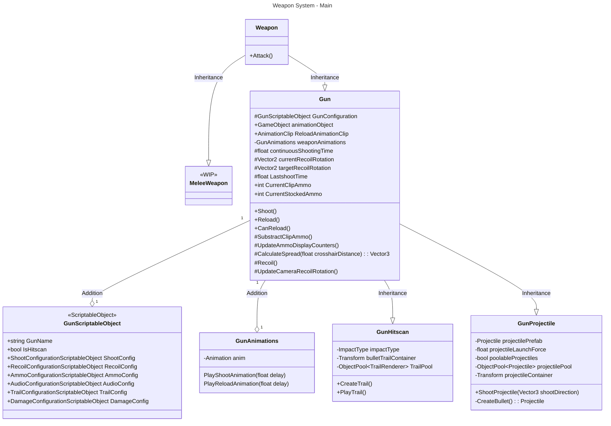
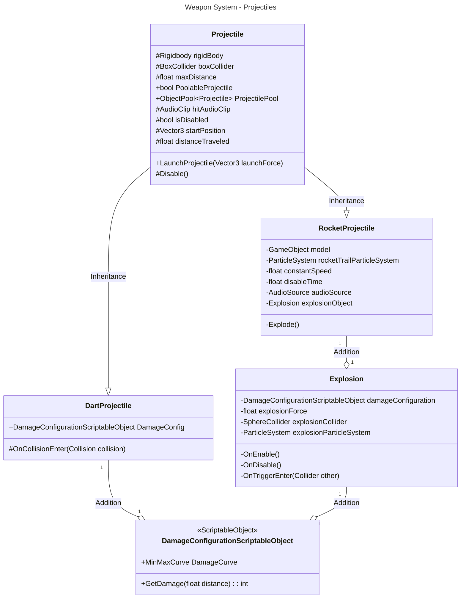
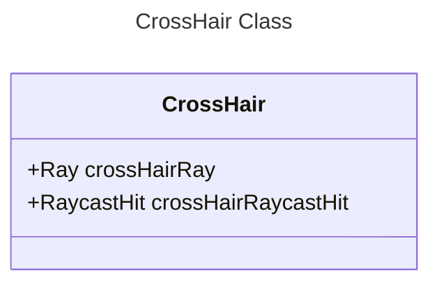

# EvilSuitcase4 (WIP)
3D third person shooter zombie wave control. Made in Unity.

The objective in this game is survive as long as you can while defeating waves of zombies. After clearing each wave, you'll receive random rewards that will help you survive next waves, but the fun part is that also certain items will be blocked randomly each wave, thus aiming for high replayability.

## Roadmap

The roadmap will be split into what has already been done and what is to be developed. A lot of code from previous projects was used (with minor tweaks) to be able to have a fast prototype.

### Done

### To Do

## Third Person Shooter Controller

Our third person shooter controller is implemented using Unity's [Starter Assets - Third Person Character Controller](https://assetstore.unity.com/packages/essentials/starter-assets-third-person-character-controller-196526) - [Unity Technologies](https://assetstore.unity.com/publishers/1).

Using this package as its base for character and movement control, we added a new class called ***ThirdPersonShooterController*** which manages all weapon related methods, such as activating equipped weapons, activating their rigs, etc.

## Damage System

Our damage system is based on a base class called ***Damageable*** which is defined as follows:

## Impact System and Surface Manager

Our impact system is an implementation of [Surface Manager](https://github.com/llamacademy/surface-manager) - [Llam Academy](https://www.youtube.com/@LlamAcademy).

Using this we are able to define audio and particle (or any game object spawn) effects for a collision depending on the type of texture of the collider. So far this is used for bullet collisions with different materials, bullet shell drops and magazine shell drops. Soon to be implemented to work on footsteps, so we can have different sound effects for different stepped objects.

Also, what makes it easy to use is that it's based on ***Scriptable Objects*** for holding all the information related to the effects, impact type and surface types. 

## Weapon System

Weapon system created using S.O.L.I.D principles for modularity and better code. Scriptable Object based weapons, thus creating new weapons is easier. 

This weapon system is supposed to have the classes ***Gun*** and ***MeleeWeapon*** as a base. So far ***GunHitscan*** and ***GunProjectile*** classes based on the ***Gun*** class have already been created, but ***MeleeWeapon*** weapons are also on the roadmap.

All animations for holding and aiming guns are _Procedural Animations_ which run on top of the base animations from the third person controller. Also, for reloading animations, new animations were created using the ***Animation Rigging*** system.

### Hitscan Guns

Hitscan guns don't actually shoot bullets, but instead cast a ray which will cause damage to _Damageable_ classes on hit. For these type of guns we will define a _Trail Renderer_, as well as its _Damage Configuration_.

So far the weapons implemented are:
- ***Pistol***
- ***Machinegun***
- ***Shotgun***
- ***Uzi***

### Projectile Guns

Projectile guns use physic based projectiles instead of raycasts. These projectiles will vary depending on the weapon used, so far we have the following weapons:
- ***Crossbow:*** uses _DartProjectile_ as a projectile
- ***RocketLauncher:*** uses _RocketProjectile_ as a projectile

In the case of the _Crossbow_, the damage is done when the dart projectile hits an object (only if this object is of type _Damageable_). Also, after hitting its target, the dart shot will remain attached to the collided game object.

For the _RocketLauncher_, a misile of the class _RocketProjectile_ is shot, which will explode by colliding to an object or after traveling certain defined distance.

### Weapon System Class Diagrams

### CrossHair

A ***CrossHair*** class was also created for better aiming and as a target for our _Procedural Animations_. The position of this CrossHair will be the point in which a ray casted from the center of our camera collides with an object, if no collision is detected the position of the CrossHair will be a hundred meters forward from the camera in the ray direction.

The position is updated on the _Update()_ method.

