# EvilSuitcase4 (WIP)
3D third person shooter zombie wave control. Made in Unity.

The objective in this game is to survive as long as you can while defeating waves of zombies. After clearing each wave, you'll receive random rewards that will help you survive next waves, but the fun part is that also certain items will be blocked randomly each wave, thus aiming for high replayability.

## Roadmap

The roadmap will be split into what has already been done and what is to be developed. A lot of code from previous projects was used (with minor tweaks) to be able to have a fast prototype.

### Done

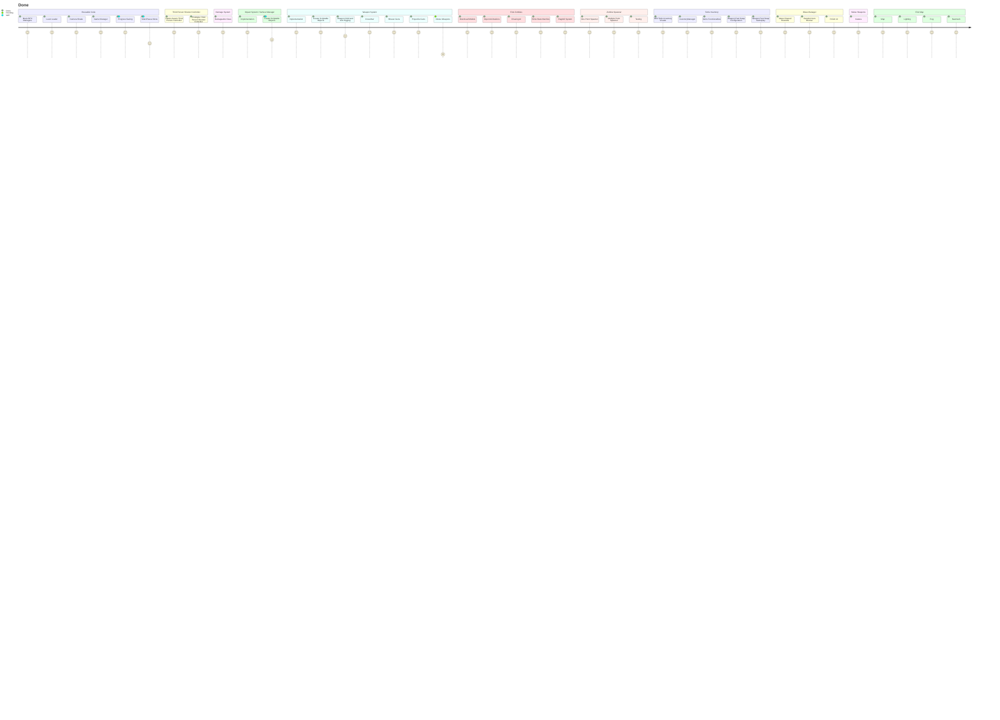

### To Do

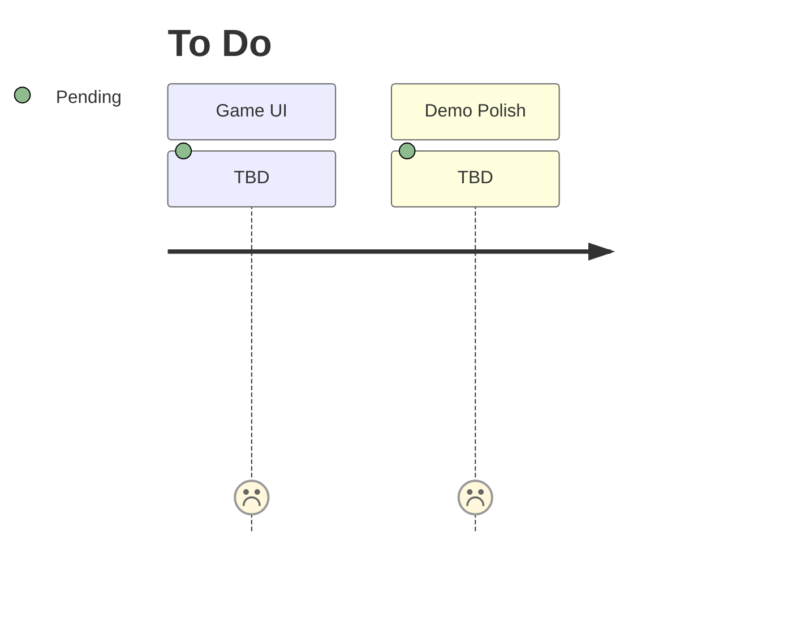

## Third Person Shooter Controller

Our third person shooter controller is implemented using Unity's [Starter Assets - Third Person Character Controller](https://assetstore.unity.com/packages/essentials/starter-assets-third-person-character-controller-196526) - [Unity Technologies](https://assetstore.unity.com/publishers/1).

Using this package as its base for character and movement control, we added a new class called ***ThirdPersonShooterController*** which manages all weapon related methods, such as activating equipped weapons, activating their rigs, etc.

## Damage System

Our damage system is based on a base class called ***Damageable*** which is defined as follows:

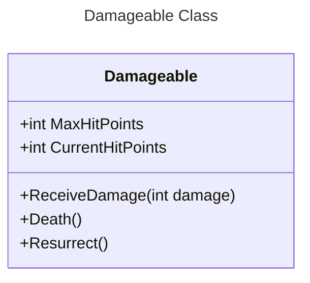

## Impact System and Surface Manager

Our impact system is an implementation of [Surface Manager](https://github.com/llamacademy/surface-manager) - [Llam Academy](https://www.youtube.com/@LlamAcademy).

Using this we are able to define audio and particle (or any game object spawn) effects for a collision depending on the type of texture of the collider. So far this is used for bullet collisions with different materials, bullet shell drops and magazine shell drops. Soon to be implemented to work on footsteps, so we can have different sound effects for different stepped objects.

Also, what makes it easy to use is that it's based on ***Scriptable Objects*** for holding all the information related to the effects, impact type and surface types. 

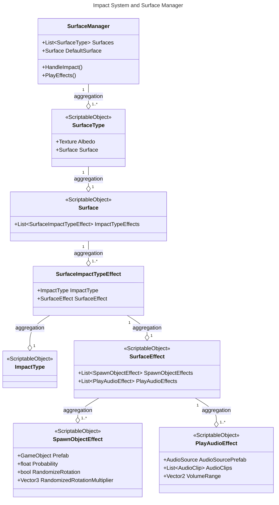

## Weapon System

Weapon system created using S.O.L.I.D principles for modularity and better code. Scriptable Object based weapons, thus creating new weapons is easier. 

This weapon system is supposed to have the classes ***Gun*** and ***MeleeWeapon*** as a base. So far ***GunHitscan*** and ***GunProjectile*** classes based on the ***Gun*** class have already been created, but ***MeleeWeapon*** weapons are also on the roadmap.

All animations for holding and aiming guns are _Procedural Animations_ which run on top of the base animations from the third person controller. Also, for reloading animations, new animations were created using the ***Animation Rigging*** system.

### Melee Weapons

Melee weapons consist on weapons which deliver attacks by themselves by swinging them. For this demo, only a Katana was programmed and rigged since by using animation rigging, we are unable to properly use mocap animations. All attack animations were made by using animation rigging solutions.

### Hitscan Guns

Hitscan guns don't actually shoot bullets, but instead cast a ray which will cause damage to _Damageable_ classes on hit. For these type of guns we will define a _Trail Renderer_, as well as its _Damage Configuration_.

So far the weapons implemented are:
- ***Pistol***
- ***Machinegun***
- ***Shotgun***
- ***Uzi***

### Projectile Guns

Projectile guns use physic based projectiles instead of raycasts. These projectiles will vary depending on the weapon used, so far we have the following weapons:
- ***Crossbow:*** uses _DartProjectile_ as a projectile
- ***RocketLauncher:*** uses _RocketProjectile_ as a projectile

In the case of the _Crossbow_, the damage is done when the dart projectile hits an object (only if this object is of type _Damageable_). Also, after hitting its target, the dart shot will remain attached to the collided game object.

For the _RocketLauncher_, a misile of the class _RocketProjectile_ is shot, which will explode by colliding to an object or after traveling certain defined distance.

### Weapon System Class Diagrams

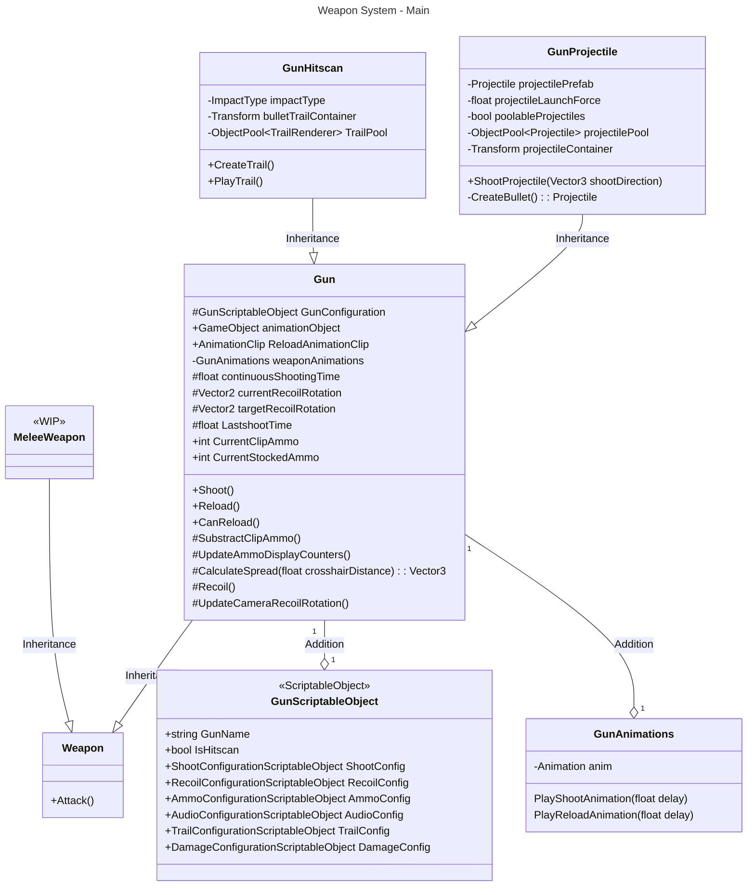

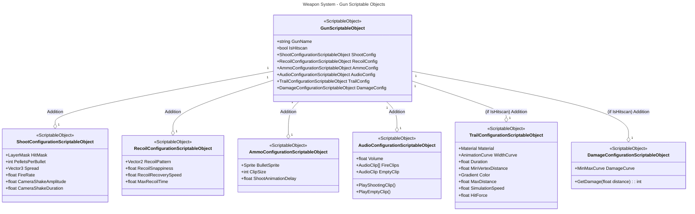

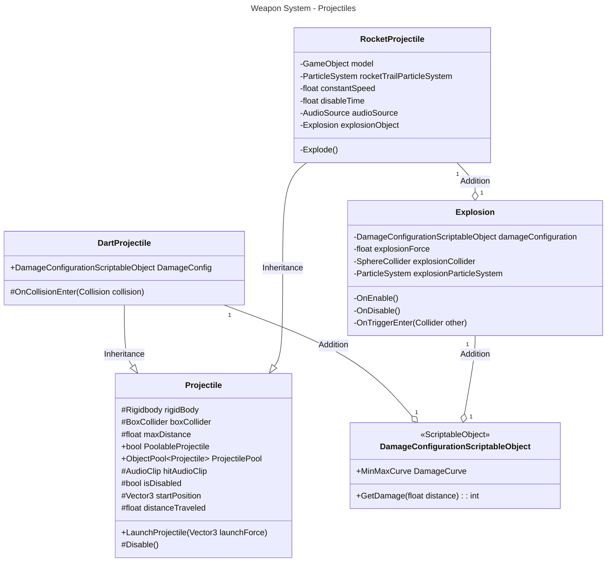

### CrossHair

A ***CrossHair*** class was also created for better aiming and as a target for our _Procedural Animations_. The position of this CrossHair will be the point in which a ray casted from the center of our camera collides with an object, if no collision is detected the position of the CrossHair will be a hundred meters forward from the camera in the ray direction.

The position is updated on the _Update()_ method.

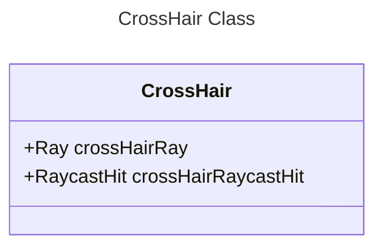

## Enemies

For our enemies we picked zombies of different types, which will behave slightly different from other variations to add more dynamism. All zombies will use the Finite State Machine pattern and will vary their states depending on the type of zombie. 

Also, for a more realistic approach to hit reaction and death we will use Unity's Ragdolls to add physics based reactions to our hits. Each hit will trigger the ragdoll and add force to the hit body part, then by disabling the ragdoll and saving the local position and rotation of the different muscles we can simulate the hit as if it was a ragdoll without losing the animations. On top of that, we added a limit force that our enemies will resist, and if that limit is surpassed they'll enter the ragdoll mode and fall (_ZombieRagdollState_) and then stand up and go back to chasing or attacking depending on its distance to the player.

For locomotion we will be using a _NavMeshAgent_ for our enemies so they avoid obstacles, but for more realistic movement we will be using root motion.

### First Zombie (Walking and Runnning versions)

Our first zombie uses a Finite State Machine with the following states: _ZombieChaseState_, _ZombieAttackState_, _ZombieRagdollState_, _ZombieResettingBonesState_, _ZombieStandingState_ and _ZombieDeadState_. As in a Finite State Machine, enemies can only be in one state at a time and in this machine the base states are the _Chase_ and _Attack_ states, which change depending on the distance to the player. 

The _Ragdoll_, _ResettingBones_ and _Standing_ states are all ragdoll based states, being the falling, getting in position and standing state respectively.

As mentioned above, on top of the Finite State Machine we have a _Ragdoll System_ which will be used for hit reaction, which enables the ragdoll for a frame to check the new position of their hit body parts and then interpolates those positions with the animated positions to give a realistic feel when hit. The state of the machine will only change to ragdoll mode if certain threshold is surpassed, otherwise this system will only work on top of the FSM.

## Inventory System

One of the main iconic mechanincs of this game will be based on its inventory, which works like the suitcase inventory seen in Resident Evil 4 or Escape from Tarkov. The main idea of using this inventory system is to give the player more difficulty when setting their needed items for next waves of zombies all while having a set time limit. Also, to further down the difficulty we will be blocking items each wave to make it even more random and unexpected.

### Inventory Manager

This class is the one responsible for storing the information of the current items that we have. How much ammo of each type do we have, what weapons do we have set in fast swap shortcuts, etc.

### Inventory UI

This class will be the responsible of enabling/disabling all UI elements involved in this inventory system, being the pause menu (in which we can see the items we're currently holding, sort them, equip or discard items), rewards menu (open each time we finish a wave), fast swap configuration and fast swap gameplay panels.

### Enums

To be used across different classes related to the inventory system we will be using the following enums:

- AmmoType:
  - Ammo9mm
  - Ammo7mm
  - Ammo12G
  - AmmoRocketLauncher
  - AmmoCrossbow
  
- ItemType:
  - Ammo
  - Gun
  - Melee
  - Consumable
  
### Grid

Is the main class in which Inventories are based on, defining the actual grid, positions, etc.

### Inventory Visual Related Classes

In this section we will briefly describe the classes involved in the visual aspect of the inventory system.

- Inventory: main canvas panel of the inventory system. This is where items will be stored and placed and we can have multiple inventory panels in the game, so we will differentiate between main inventories (ones which represent our actual inventory) and non main inventories (which represent inventories containing rewards to be used)
- InventoryDragDropSystem: as the name implies, this class has the drag and drop functionalities, checking when items are being dragged and then placed in different positions of inventories
- InventoryManualPlacement: this class is made for testing purposes, so we can quickly test if the inventories are working correctly. Used to populate manually any inventory
- ItemGhost: when dragging any item we will display its visual reference as a moving "ghost", and this class is responsible for that behaviour

### Item Related Classes

Items are the main component of our inventories, as mentioned above in the enums section we have different types of items, such as _Guns_, _Melee weapons_, _Consumables_ and _Ammo_.

Constant information is stored in the ***ItemScriptableObject*** class, which holds information about the item dimensions, item type, item name and different prefabs used throught inventories.

Variable information will be stored in the Item class category, for example being it current ammo, max ammo capacity, etc.

Also for the drag and drop system to work properly we will attach the ItemDragDrop class to all item prefabs.

## Wave Manager and Rewards

To control the main loop for the game we will be using a wave control model in which we set certain number of zombies to be spawned each wave and by defeating them we will get rewards accordingly to the difficulty of each level.

### Wave Manager
Structs were created to populate lists which contain information about the enemies to be spawned and rewards to be given each wave. These enums are as follows:

#### Spawn Object Struct

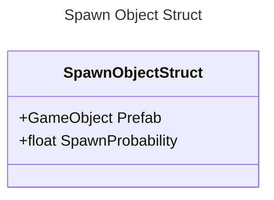

On the _Prefab_ variable, enemy prefabs will be used. On the other hand, the _SpawnProbability_ variable is a variable between 0 and 1 which determines the possibility of spawning its respective prefab.

#### Wave Spawn Struct

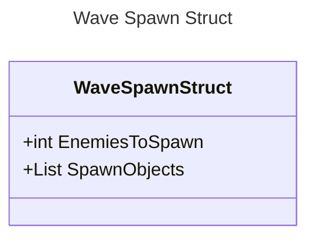

For each wave, we will define a list of _SpawnObjectStruct_ objects, which will define the type of enemies to be spawned.

#### Reward Item

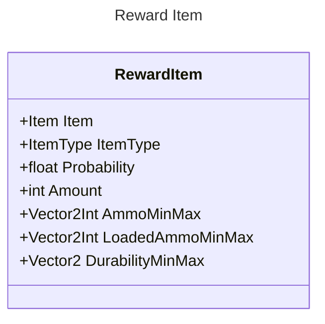
This struct will determine an item to be given as a reward (with certain probability), also depending on the item type we will set different vectors which will determine information about the reward item, for example, the amount of ammo certain weapon is currenty loaded with when awarded.

#### Wave Rewards Struct

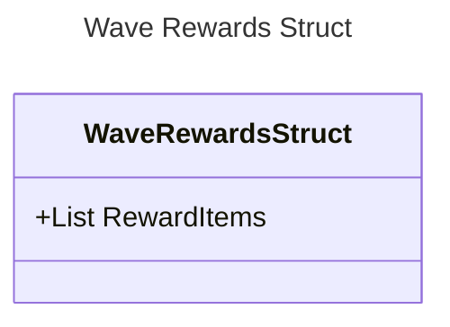

### Rewards

As for the rewards, these will be given in a specific UI designed to hold different inventories. On the left side we will have the main inventory and on the right side of the UI we will have a scrollable area containing three reward inventories, separated by item type, being Consumables, Melee and Gun inventories respectively.
